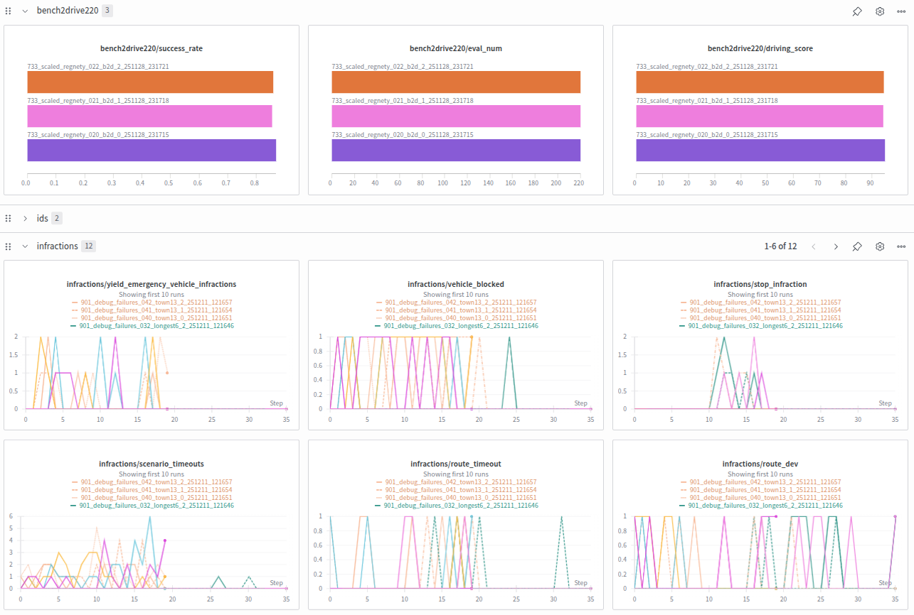
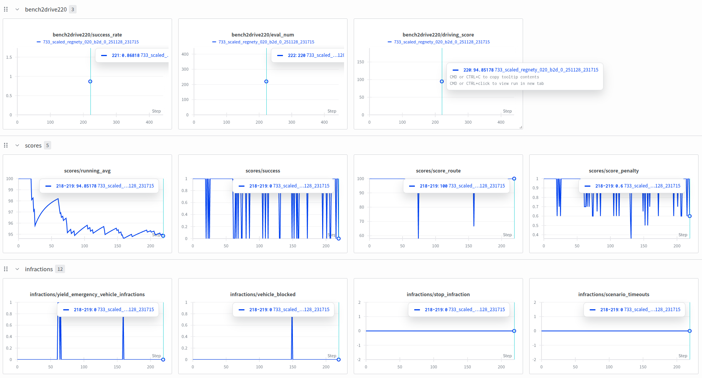

<h2 align="center">
<b> Minimizing Learner–Expert Asymmetry in End-to-End Driving </b>
</h2>

<div align="center">

https://github.com/user-attachments/assets/9f316ad2-e629-4bb4-bffb-9bb55e225738

</div>

<p align="center">
  <a href="https://ln2697.github.io/lead" style="text-decoration: none;">Website | </a>
  <a href="https://ln2697.github.io/lead/docs" style="text-decoration: none;">Documentation | </a>
  <a href="https://huggingface.co/datasets/ln2697/lead_carla" style="text-decoration: none;">CARLA Dataset | </a>
  <a href="https://huggingface.co/ln2697/tfv6" style="text-decoration: none;">CARLA Model | </a>
  <a href="https://huggingface.co/ln2697/tfv6_navsim" style="text-decoration: none;">NAVSIM Model | </a>
  <a href="https://ln2697.github.io/assets/pdf/Nguyen2026LEADSUPP.pdf" style="text-decoration: none;">Supplementary | </a>
  <a href="https://arxiv.org/abs/2512.20563" style="text-decoration: none;">Paper</a>
</p>


## Table of Contents

- [Table of Contents](#table-of-contents)
- [Updates](#updates)
- [Quick Start](#quick-start)
  - [1. Environment initialization](#1-environment-initialization)
  - [2. Install dependencies](#2-install-dependencies)
  - [3. Download checkpoints](#3-download-checkpoints)
  - [4. Evaluate model](#4-evaluate-model)
  - [5. Verify autopilot](#5-verify-autopilot)
- [Training for CARLA Leaderboard](#training-for-carla-leaderboard)
  - [1. Download training data](#1-download-training-data)
  - [2. Build data cache](#2-build-data-cache)
  - [3. Train model](#3-train-model)
  - [4. Post-train model](#4-post-train-model)
  - [5. Large-scale training on SLURM](#5-large-scale-training-on-slurm)
- [Evaluation on CARLA Leaderboard](#evaluation-on-carla-leaderboard)
  - [1. Start CARLA](#1-start-carla)
  - [2. Evaluate on Bench2Drive](#2-evaluate-on-bench2drive)
  - [3. Evaluate on Longest6](#3-evaluate-on-longest6)
  - [4. Evaluate on Town13](#4-evaluate-on-town13)
  - [5. Clean CARLA](#5-clean-carla)
  - [6. Large-scale evaluation on SLURM](#6-large-scale-evaluation-on-slurm)
- [Beyond CARLA: Cross-Benchmark Deployment](#beyond-carla-cross-benchmark-deployment)
- [Further Documentation](#further-documentation)
- [Acknowledgements](#acknowledgements)
- [Citation](#citation)
- [License](#license)

## Updates

- **`[COMING SOON]`** Cross-benchmark datasets and training tools
  > Datasets and documentation for NAVSIM and Waymo training coming soon.

- **`[2026/01/13]`** CARLA dataset and training documentation released
  > We publicly release a CARLA dataset generated with the same pipeline as described in the paper. Note that due to subsequent refactoring and code cleanup, the released dataset differs from the original dataset used in our experiments. Validation is ongoing.

- **`[2026/01/05]`** Removed stop-sign heuristic
  > We removed explicit stop-sign handling to evaluate the policy in a fully end-to-end setting. This may slightly reduce closed-loop performance compared to earlier runs.

- **`[2026/01/05]`** RoutePlanner bug fix
  > Fixed an index error that caused the driving policy to crash at the end of routes in Town13. Driving scores have been updated accordingly.

- **`[2025/12/24]`** Initial release
  > Paper, checkpoints, expert driver, and inference code are now available.

## Quick Start

### 1. Environment initialization

Clone the repository and map the project root to your environment

```bash
git clone https://github.com/autonomousvision/lead.git
cd lead
```

Set up environment variables

```bash
echo -e "export LEAD_PROJECT_ROOT=$(pwd)" >> ~/.bashrc  # Set project root variable
echo "source $(pwd)/scripts/main.sh" >> ~/.bashrc       # Persist more environment variables
source ~/.bashrc                                        # Reload config
```

Please verify that ~/.bashrc reflects these paths correctly.

### 2. Install dependencies

We utilize [Miniconda](https://www.anaconda.com/docs/getting-started/miniconda/install), conda-lock and uv:

```bash
# Install conda-lock and create conda environment
pip install conda-lock && conda-lock install -n lead conda-lock.yml
# Activate conda environment
conda activate lead
# Install dependencies and setup git hooks
pip install uv && uv pip install -r requirements.txt && uv pip install -e .
# Install other tools needed for development
conda install conda-forge::ffmpeg conda-forge::parallel conda-forge::tree conda-forge::gcc
# Optional: Activate git hooks
pre-commit install
```

While waiting for dependencies installation, we recommend CARLA setup on parallel:

```bash
bash scripts/setup_carla.sh # Download and setup CARLA at 3rd_party/CARLA_0915
```

### 3. Download checkpoints

Pre-trained checkpoints are hosted on [HuggingFace](https://huggingface.co/ln2697/tfv6) for reproducibility. These checkpoints follow the TFv6 architecture, but differ in their sensor configurations, vision backbones or dataset composition.

<br>
<div align="center">

| Description                           | Bench2Drive | Longest6 v2 |  Town13  |                                 Checkpoint                                  |
| ------------------------------------- | :---------: | :---------: | :------: | :-------------------------------------------------------------------------: |
| Full TransFuser V6                    |  **95.2**   |   **62**    | **5.24** |    [Link](https://huggingface.co/ln2697/tfv6/tree/main/tfv6_regnety032)     |
| ResNet34 backbone with 60M parameters |    94.7     |     57      |   5.01   |     [Link](https://huggingface.co/ln2697/tfv6/tree/main/tfv6_resnet34)      |
| Rear camera as additional input       |    95.1     |     53      |    -     |   [Link](https://huggingface.co/ln2697/tfv6/tree/main/4cameras_resnet34)    |
| Radar sensor removed                  |    94.7     |     52      |    -     |    [Link](https://huggingface.co/ln2697/tfv6/tree/main/noradar_resnet34)    |
| Vision only driving                   |    91.6     |     43      |    -     |  [Link](https://huggingface.co/ln2697/tfv6/tree/main/visiononly_resnet34)   |
| Removed Town13 from training set      |    93.1     |     52      |   3.52   | [Link](https://huggingface.co/ln2697/tfv6/tree/main/town13heldout_resnet34) |

**Table 1:** Performance of pre-trained checkpoints. We report Driving Score, for which higher is better.

</div>
<br>

To download one single checkpoint for test purpose:

```bash
bash scripts/download_one_checkpoint.sh
```

Or download all checkpoints at once with <a href="https://docs.github.com/en/repositories/working-with-files/managing-large-files/installing-git-large-file-storage">git lfs</a>

```bash
git clone https://huggingface.co/ln2697/tfv6 outputs/checkpoints
cd outputs/checkpoints
git lfs pull
```

### 4. Evaluate model

To initiate closed-loop evaluation and verify the setup, execute the following:

```bash
# Start driving environment
bash scripts/start_carla.sh
# Start policy on one route
bash scripts/eval_bench2drive.sh
```

Driving logs will be saved to <code>outputs/local_evaluation</code> with the following structure:

```html
outputs/local_evaluation/1_town15_construction
├── 1_town15_construction_debug.mp4
├── 1_town15_construction_demo.mp4
├── 1_town15_construction_input.mp4
├── checkpoint_endpoint.json
├── debug_images
├── demo_images
├── input_images
├── input_log
├── infractions.json
├── metric_info.json
└── qualitative_results.mp4
```
Launch the interactive infraction dashboard to analyze driving failures:

```bash
python lead/infraction_webapp/app.py
```

Navigate to [http://localhost:5000](http://localhost:5000) to access the dashboard

<br>

<div align="center">

https://github.com/user-attachments/assets/81954b7c-4153-45d1-90a8-80cb426ccb70

  **Video 2:** Interactive infraction analysis tool for model evaluation.

</div>
<br>

> [!TIP]
> 1. Disable video recording in [config_closed_loop](lead/inference/config_closed_loop.py) by turning off `produce_demo_video` and `produce_debug_video`.
> 2. If memory is limited, modify the file prefixes to load only the first checkpoint seed. By default, the pipeline loads all three seeds as an ensemble.

### 5. Verify autopilot

Verify the expert policy and data acquisition pipeline by executing a test run on a sample route:

```bash
# Start CARLA if not done already
bash scripts/start_carla.sh
# Run expert on one route
bash scripts/run_expert.sh
```

Data collected will be stored at <code>data/expert_debug</code> and should have following structure:

```html
data/expert_debug/
├── data
│   └── debug_routes
│       └── Town15_Rep-1_1_town15_construction_route0_01_15_12_48_52
│           ├── bboxes
│           ├── camera_pc
│           ├── camera_pc_perturbated
│           ├── depth
│           ├── depth_perturbated
│           ├── hdmap
│           ├── hdmap_perturbated
│           ├── instance
│           ├── instance_perturbated
│           ├── lidar
│           ├── metas
│           ├── radar
│           ├── radar_perturbated
│           ├── results.json
│           ├── rgb
│           ├── rgb_perturbated
│           ├── semantics
│           └── semantics_perturbated
└── results
    └── 1_town15_construction_result.json
```

The [Jupyter notebooks](notebooks) provide some example scripts to visualize the collected data:

<br>
<div align="center">
  <picture>
    
  </picture>
  <picture>
    
  </picture>

  **Figure 2:** Example outputs of data visualization notebooks.

</div>
<br>

## Training for CARLA Leaderboard

For a more detailed documentation, take a look at the [documentation page](https://ln2697.github.io/lead/docs/carla_training.html).

### 1. Download training data

Download the CARLA dataset from [HuggingFace](https://huggingface.co/datasets/ln2697/lead_carla) using git lfs:

```bash
git clone https://huggingface.co/datasets/ln2697/lead_carla data/carla_leaderboard2
cd data/carla_leaderboard2
git lfs pull
```

Or download a single route for testing:

```bash
bash scripts/download_one_route.sh
```

Unzip the downloaded routes:

```bash
bash scripts/unzip_routes.sh
```

### 2. Build data cache

Build persistent cache for faster data loading during training:

```bash
python scripts/build_cache.py
```

### 3. Train model

Start pretraining:

```bash
bash scripts/pretrain.sh
```

For multi-GPU training with Distributed Data Parallel:

```bash
bash scripts/pretrain_ddp.sh
```

Training logs and checkpoints will be saved to `outputs/local_training/pretrain`.

### 4. Post-train model

Fine-tune the pretrained model with planning decoder enabled:

```bash
bash scripts/posttrain.sh
```

For multi-GPU training:

```bash
bash scripts/posttrain_ddp.sh
```

Post-training checkpoints will be saved to `outputs/local_training/posttrain`. We also include TensorBoard and WandB logging

<br>
<div align="center">
  <picture>
    
  </picture>

  **Figure 3:** Example WandB logging with training visualization.

</div>
<br>

### 5. Large-scale training on SLURM

For distributed training on SLURM, see this [documentation page](https://ln2697.github.io/lead/docs/slurm_training.html). For a complete SLURM workflow of pre-training, post-training, evaluation, see this [example](slurm/experiments/001_example).

## Evaluation on CARLA Leaderboard

For a more detailed documentation, take a look at the [evaluation documentation](https://ln2697.github.io/lead/docs/evaluation.html).

### 1. Start CARLA

Start the CARLA simulator before running evaluation:

```bash
bash scripts/start_carla.sh
```

### 2. Evaluate on Bench2Drive

Run closed-loop evaluation on the Bench2Drive benchmark:

```bash
bash scripts/eval_bench2drive.sh
```

### 3. Evaluate on Longest6

Run closed-loop evaluation on the Longest6 v2 benchmark:

```bash
bash scripts/eval_longest6.sh
```

### 4. Evaluate on Town13

Run closed-loop evaluation on the Town13 benchmark:

```bash
bash scripts/eval_town13.sh
```

Results will be saved to `outputs/local_evaluation/` with videos, infractions, and metrics.

### 5. Clean CARLA

If CARLA becomes unresponsive, clean up zombie processes:

```bash
bash scripts/clean_carla.sh
```

### 6. Large-scale evaluation on SLURM

For distributed evaluation across multiple routes and benchmarks, see the [SLURM evaluation documentation](https://ln2697.github.io/lead/docs/slurm_evaluation.html). For large-scale evaluation we also provide a WandB logger.

<br>
<div align="center">
  <picture>
    
  </picture>

  **Figure 4:** Example online WandB logging during evaluation.

</div>
<br>

## Beyond CARLA: Cross-Benchmark Deployment

The LEAD pipeline and TFv6 models are deployed as **reference implementations and benchmark entries** across multiple autonomous driving simulators and evaluation suites:

* **[Waymo Vision-based End-to-End Driving Challenge (DiffusionLTF)](https://waymo.com/open/challenges/2025/e2e-driving/)**
  Strong baseline entry for the inaugural end-to-end driving challenge hosted by Waymo, achieving **2nd place** in the final leaderboard.

* **[NAVSIM v1 (LTFv6)](https://huggingface.co/spaces/AGC2024-P/e2e-driving-navtest)**
  Latent TransFuser v6 is an updated reference baseline for the `navtest` split, improving PDMS by +3 points over the Latent TransFuser baseline, used to evaluate navigation and control under diverse driving conditions.

* **[NAVSIM v2 (LTFv6)](https://huggingface.co/spaces/AGC2025/e2e-driving-navhard)**
  The same Latent TransFuser v6 improves EPMDS by +6 points over the Latent TransFuser baseline, targeting distribution shift and scenario complexity.

* **[NVIDIA AlpaSim Simulator (TransFuserModel)](https://github.com/NVlabs/alpasim)**
  Adapting the NAVSIM's Latent TransFuser v6 checkpoints, AlpaSim also features an official TransFuser driver, serving as a baseline policy for closed-loop simulation.

## Further Documentation

For more detailed instructions, see the [full documentation](https://ln2697.github.io/lead/docs). In particular:
- [Training data collection](https://ln2697.github.io/lead/docs/data_collection.html)
- [Training](https://ln2697.github.io/lead/docs/carla_training.html)
- [Evaluation](https://ln2697.github.io/lead/docs/carla_training.html)

## Acknowledgements

Special thanks to [carla_garage](https://github.com/autonomousvision/carla_garage) for the foundational codebase. We also thank the creators of the numerous open-source projects we use:

- [PDM-Lite](https://github.com/OpenDriveLab/DriveLM/blob/DriveLM-CARLA/pdm_lite/docs/report.pdf), [leaderboard](https://github.com/carla-simulator/leaderboard), [scenario_runner](https://github.com/carla-simulator/scenario_runner), [NAVSIM](https://github.com/autonomousvision/navsim), [Waymo Open Dataset](https://github.com/waymo-research/waymo-open-dataset)

Other helpful repositories:

- [SimLingo](https://github.com/RenzKa/simlingo), [PlanT2](https://github.com/autonomousvision/plant2), [Bench2Drive Leaderboard](https://github.com/autonomousvision/Bench2Drive-Leaderboard), [Bench2Drive](https://github.com/Thinklab-SJTU/Bench2Drive/), [CaRL](https://github.com/autonomousvision/CaRL)

Long Nguyen led development of the project. Kashyap Chitta, Bernhard Jaeger, and Andreas Geiger contributed through technical discussion and advisory feedback. Daniel Dauner provided guidance with NAVSIM.

## Citation

If you find this work useful, please consider giving this repository a star ⭐ and citing our work in your research:

```bibtex
@article{Nguyen2025ARXIV,
  title={LEAD: Minimizing Learner-Expert Asymmetry in End-to-End Driving},
  author={Nguyen, Long and Fauth, Micha and Jaeger, Bernhard and Dauner, Daniel and Igl, Maximilian and Geiger, Andreas and Chitta, Kashyap},
  journal={arXiv preprint arXiv:2512.20563},
  year={2025}
}
```

## License

This project is released under the MIT License. See [LICENSE](LICENSE) for details.
