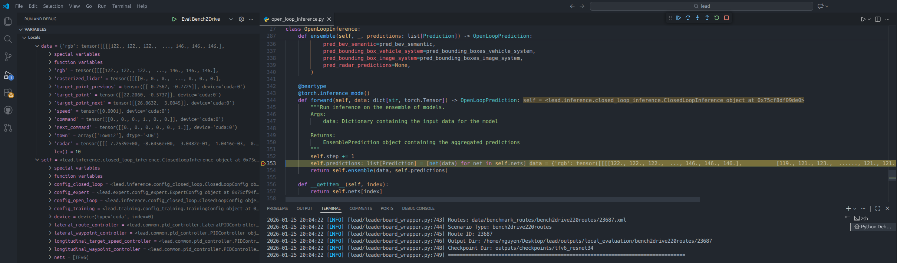
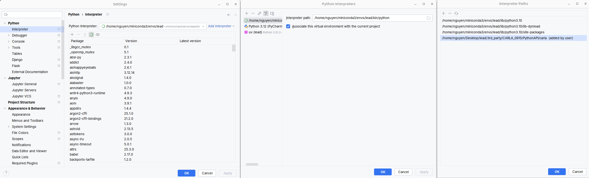

<h2 align="center">
<b> Minimizing Learner–Expert Asymmetry in End-to-End Driving </b>
</h2>

<p align="center">
  <a href="https://ln2697.github.io/lead" style="text-decoration: none;">Website</a> <span style="color: #0969da;">|</span>
  <a href="https://ln2697.github.io/lead/docs" style="text-decoration: none;">Docs</a> <span style="color: #0969da;">|</span>
  <a href="https://huggingface.co/datasets/ln2697/lead_carla" style="text-decoration: none;">Dataset</a> <span style="color: #0969da;">|</span>
  <a href="https://huggingface.co/ln2697/tfv6" style="text-decoration: none;">Model</a> <span style="color: #0969da;">|</span>
  <a href="https://huggingface.co/ln2697/tfv6_navsim" style="text-decoration: none;">NAVSIM Model</a> <span style="color: #0969da;">|</span>
  <a href="https://ln2697.github.io/assets/pdf/Nguyen2026LEADSUPP.pdf" style="text-decoration: none;">Supplementary</a> <span style="color: #0969da;">|</span>
  <a href="https://arxiv.org/abs/2512.20563" style="text-decoration: none;">Paper</a>
  <br><br>
  An open-source end-to-end driving stack for CARLA, achieving state-of-the-art closed-loop performance across all major Leaderboard 2.0 benchmarks 🏆
  <br><br>
  
  
  
  <br>
</p>


## Table of Contents

- [Table of Contents](#table-of-contents)
- [Updates](#updates)
- [Quick Start CARLA Leaderboard](#quick-start-carla-leaderboard)
  - [1. Environment initialization](#1-environment-initialization)
  - [2. Install dependencies](#2-install-dependencies)
  - [3. Download checkpoints](#3-download-checkpoints)
  - [4. Setup VSCode/PyCharm](#4-setup-vscodepycharm)
  - [5. Evaluate model](#5-evaluate-model)
  - [6. \[Optional\] Infraction Analysis Webapp](#6-optional-infraction-analysis-webapp)
- [CARLA Training](#carla-training)
- [CARLA Data Collection](#carla-data-collection)
- [CARLA 123D Data Collection](#carla-123d-data-collection)
- [CARLA Benchmarking](#carla-benchmarking)
- [NAVSIM Training and Evaluation](#navsim-training-and-evaluation)
- [Project Structure](#project-structure)
- [Common Issues](#common-issues)
- [Beyond CARLA: Cross-Benchmark Deployment](#beyond-carla-cross-benchmark-deployment)
- [Further Documentation](#further-documentation)
- [Acknowledgements](#acknowledgements)
- [Citation](#citation)
- [License](#license)

## Updates

- **`[2026.18.03]`** Deactivated creeping heuristic.
  > By default, we deactive the creeping heuristic introduced in [TFv2](https://kait0.github.io/assets/pdf/master_thesis_bernhard_jaeger.pdf). To turn it back, set `sensor_agent_creeping=True` in [config_closed_loop](lead/inference/config_closed_loop.py).

- **`[2026.25.02]`** LEAD is accepted to CVPR 2026! 🎉

- **`[2026.25.02]`** NAVSIM extension released.
  > Code and [instructions](https://github.com/autonomousvision/lead?tab=readme-ov-file#navsim-training-and-evaluation) released. Supplementary data coming soon.

- **`[2026.02.02]`** Preliminary support for [123D](https://github.com/autonomousvision/py123d).
  > Collecting, loading and visualizing driving data in unified data format. See [instructions](https://github.com/autonomousvision/lead?tab=readme-ov-file#carla-123d-data-collection).

- **`[2026.01.18]`** Deactivated Kalman filter.
  > By default, we deactivate the Kalman filter introduced in [TFv3](https://www.cvlibs.net/publications/Chitta2022PAMI.pdf). To turn the kalman filter on, set `use_kalman_filter=True` in [config_closed_loop](lead/inference/config_closed_loop.py).

- **`[2026.01.13]`** CARLA dataset and training documentation released.
  > We publicly release the CARLA dataset to reproduce the paper's main results. The released dataset differs to the original dataset used in our experiments due to refactoring.

- **`[2026.01.05]`** Deactivated stop-sign heuristic.
  > By default, we deactivate explicit stop-sign handling introduced in [TFv4](https://arxiv.org/abs/2306.07957). To turn the heuristic on, set `slower_for_stop_sign=True` in [config_closed_loop](lead/inference/config_closed_loop.py).

- **`[2026.01.05]`** RoutePlanner bug fix.
  > Fixed an index error that caused the driving policy to crash at the end of routes in Town13. Driving scores have been updated accordingly.

- **`[2025.12.24]`** Initial release.
  > Paper, checkpoints, expert driver, and inference code are now available.

## Quick Start CARLA Leaderboard

### 1. Environment initialization

Clone the repository and map the project root to your environment:

```bash
git clone https://github.com/autonomousvision/lead.git
cd lead

# Set project root variable
echo -e "export LEAD_PROJECT_ROOT=$(pwd)" >> ~/.bashrc

# Activate project's hook
echo "source $(pwd)/scripts/main.sh" >> ~/.bashrc

# Reload shell's config
source ~/.bashrc
```

Please verify that `~/.bashrc` reflects these paths correctly.

### 2. Install dependencies

We utilize Miniconda, conda-lock and uv:

```bash
# Create conda environment
pip install conda-lock && conda-lock install -n lead conda-lock.yml

# Activate conda environment
conda activate lead

# Install dependencies and setup git hooks
pip install uv && uv pip install -r requirements.txt && uv pip install -e .

# Install other tools needed for development
conda install -c conda-forge ffmpeg parallel tree gcc zip unzip

# Optional: Activate git hooks
pre-commit install
```

Setup CARLA:

```bash
# Download and setup CARLA at 3rd_party/CARLA_0915
bash scripts/setup_carla.sh

# Or softlink your pre-installed CARLA
ln -s /your/carla/path 3rd_party/CARLA_0915
```

### 3. Download checkpoints

Pre-trained checkpoints are hosted on HuggingFace. To reproduce the numbers, please turn on the Kalman filter and stop-sign heuristic.

<div align="center">

| Description                           | Bench2Drive | Longest6 v2 |  Town13  |                                 Checkpoint                                  |
| ------------------------------------- | :---------: | :---------: | :------: | :-------------------------------------------------------------------------: |
| Full TransFuser V6                    |  **95.2**   |   **62**    | **5.24** |    [Link](https://huggingface.co/ln2697/tfv6/tree/main/tfv6_regnety032)     |
| ResNet34 backbone with 60M parameters |    94.7     |     57      |   5.01   |     [Link](https://huggingface.co/ln2697/tfv6/tree/main/tfv6_resnet34)      |
| Rear camera as additional input       |    95.1     |     53      |   TBD    |   [Link](https://huggingface.co/ln2697/tfv6/tree/main/4cameras_resnet34)    |
| Radar sensor removed                  |    94.7     |     52      |   TBD    |    [Link](https://huggingface.co/ln2697/tfv6/tree/main/noradar_resnet34)    |
| Vision only driving                   |    91.6     |     43      |   TBD    |  [Link](https://huggingface.co/ln2697/tfv6/tree/main/visiononly_resnet34)   |
| Removed Town13 from training set      |    93.1     |     52      |   3.52   | [Link](https://huggingface.co/ln2697/tfv6/tree/main/town13heldout_resnet34) |

</div>

To download checkpoints:

```bash
# Download one checkpoint for test purpose
bash scripts/download_one_checkpoint.sh

# Download all checkpoints
git clone https://huggingface.co/ln2697/tfv6 outputs/checkpoints
cd outputs/checkpoints
git lfs pull
```

### 4. Setup VSCode/PyCharm

For VSCode, install recommended extensions when prompted. We support debugging of out of the box.



For PyCharm, you need to add CARLA Python API `3rd_party/CARLA_0915/PythonAPI/carla` to your Python path `Settings... → Python → Interpreter → Show All... → Show Interpreter Paths`.




### 5. Evaluate model

To verify the setup:

```bash
# Start driving environment
bash scripts/start_carla.sh

# Start policy on one route
python lead/leaderboard_wrapper.py \
  --checkpoint outputs/checkpoints/tfv6_resnet34 \
  --routes data/benchmark_routes/bench2drive/23687.xml \
  --bench2drive
```

Driving logs will be saved to <code>outputs/local_evaluation</code> with the following structure:

```html
outputs/local_evaluation/1_town15_construction
├── 1_town15_construction_debug.mp4
├── 1_town15_construction_demo.mp4
├── 1_town15_construction_input.mp4
├── checkpoint_endpoint.json
├── debug_images
├── demo_images
├── input_images
├── input_log
├── infractions.json
├── metric_info.json
└── qualitative_results.mp4
```

### 6. [Optional] Infraction Analysis Webapp

Launch the interactive infraction dashboard to analyze driving failures. This feature is especially useful for working with Longest6 or Town13 benchmarks, where iterating evaluation logs is time-consuming:

```bash
python lead/infraction_webapp/app.py
```

Navigate to http://localhost:5000, fill the input field with `outputs/local_evaluation`.

## CARLA Training

Download the CARLA dataset from HuggingFace:

```bash
# Download all routes
git clone https://huggingface.co/datasets/ln2697/lead_carla data/carla_leaderboard2/zip
cd data/carla_leaderboard2/zip
git lfs pull

# Or download a single route for testing
bash scripts/download_one_route.sh

# Upzip the routes
bash scripts/unzip_routes.sh

# Build data cache
python scripts/build_cache.py
```

Perception pretraining. Training logs and checkpoints will be saved to `outputs/local_training/pretrain`:

```bash
# Train on a single GPU
python3 lead/training/train.py \
  logdir=outputs/local_training/pretrain

# Or Torch Distributed Data Parallel
bash scripts/pretrain_ddp.sh
```

Planning post-training. Training logs and checkpoints will be saved to `outputs/local_training/posttrain`:

```bash
# Single GPU
python3 lead/training/train.py \
  logdir=outputs/local_training/posttrain \
  load_file=outputs/local_training/pretrain/model_0030.pth \
  use_planning_decoder=true

# Or Torch Distributed Data Parallel
bash scripts/posttrain_ddp.sh
```

> [!TIP]
> 1. For distributed training on SLURM, see this [documentation page](https://ln2697.github.io/lead/docs/slurm_training.html).
> 2. For a complete SLURM workflow of pre-training, post-training, evaluation, see this [example](slurm/experiments/001_example).
> 3. For a more detailed documentation, take a look at the [documentation page](https://ln2697.github.io/lead/docs/carla_training.html).

## CARLA Data Collection

Assuming CARLA server is running. For data collection of one route, we either support running benchmark from Python (recommended for debugging):

```bash
# CARLA Leaderboard format
python lead/leaderboard_wrapper.py \
  --expert \
  --routes data/data_routes/lead/noScenarios/short_route.xml
```

Or running data collection from classic bash scripts (recommended for high flexibility):

```bash
# CARLA Leaderboard format
bash scripts/eval_expert.sh
```

Collected data in CARLA format will be saved to `outputs/expert_evaluation/` with the following sensor outputs:


```html
├── bboxes/                  # Per-frame 3D bounding boxes for all actors
├── depth/                   # Compressed and quantized depth maps
├── depth_perturbated        # Depth from a perturbated ego state
├── hdmap/                   # Ego-centric rasterized HD map
├── hdmap_perturbated        # HD map aligned to perturbated ego pose
├── lidar/                   # LiDAR point clouds
├── metas/                   # Per-frame metadata and ego state
├── radar/                   # Radar detections
├── radar_perturbated        # Radar detections from perturbated ego state
├── rgb/                     # RGB images
├── rgb_perturbated          # RGB images from perturbated ego state
├── semantics/               # Semantic segmentation maps
├── semantics_perturbated    # Semantics from perturbated ego state
└── results.json             # Route-level summary and evaluation metadata
```

> [!TIP]
> 1. To setup own camera/lidar/radar calibration, see [config_base.py](lead/common/config_base.py) and [config_expert.py](lead/expert/config_expert.py).
> 2. For large-scale data collection on SLURM clusters, see the [data collection documentation](https://ln2697.github.io/lead/docs/data_collection.html).
> 3. The [Jupyter notebooks](notebooks) provide some example scripts to visualize the collected data.

## CARLA 123D Data Collection

Assuming CARLA server is running. For data collection of one route, we either support running a  Python script (recommended for debugging):

```bash
# Setting configuration
export LEAD_EXPERT_CONFIG="target_dataset=6 \
  py123d_data_format=true \
  use_radars=false \
  lidar_stack_size=2 \
  save_only_non_ground_lidar=false \
  save_lidar_only_inside_bev=false"

# Start leaderboard
python -u $LEAD_PROJECT_ROOT/lead/leaderboard_wrapper.py \
    --expert \
    --py123d \
    --routes data/data_routes/50x38_Town12/ParkingCrossingPedestrian/3250_1.xml
```

Or use classic bash script (recommended for high flexibility):

```bash
bash scripts/eval_expert_123d.sh
```

> [!TIP]
> This feature is still experimental and in development.

## CARLA Benchmarking

Assuming CARLA server is running. For debugging, we either support running benchmark from Python (recommended for debugging):

```bash
# Bench2Drive
python lead/leaderboard_wrapper.py \
  --checkpoint outputs/checkpoints/tfv6_resnet34 \
  --routes data/benchmark_routes/bench2drive/23687.xml \
  --bench2drive

# Longest6 v2
python lead/leaderboard_wrapper.py \
  --checkpoint outputs/checkpoints/tfv6_resnet34 \
  --routes data/benchmark_routes/longest6/00.xml

# Town13
python lead/leaderboard_wrapper.py \
  --checkpoint outputs/checkpoints/tfv6_resnet34 \
  --routes data/benchmark_routes/Town13/0.xml
```

Or running benchmarks from classic bash scripts (recommended for high flexibility):

```bash
# Bench2Drive
bash scripts/eval_bench2drive.sh

# Longest6 v2
bash scripts/eval_longest6.sh

# Town13
bash scripts/eval_town13.sh
```

Results will be saved to `outputs/local_evaluation/` with videos, infractions, and metrics.

> [!TIP]
> 1. For a more detailed documentation, take a look at the [evaluation documentation](https://ln2697.github.io/lead/docs/evaluation.html).
> 2. For distributed evaluation across multiple routes and benchmarks, see the [SLURM evaluation documentation](https://ln2697.github.io/lead/docs/slurm_evaluation.html).
> 3. Our SLURM wrapper also supports WandB for reproducible benchmarking.

## NAVSIM Training and Evaluation

1. To setup `navtrain` and `navtest` splits, see [navsimv1.1/docs/install.md](3rd_party/navsim_workspace/navsimv1.1/docs/install.md).

2. Once `navtrain` training cache is built, we can start the training. See preception pre-training at [here](slurm/experiments/002_navsim_example/000_pretrain1_0.sh) and planning post-training [here](slurm/experiments/002_navsim_example/010_postrain32_0.sh).

3. To setup `navhard` split, see [navsimv2.2/docs/install.md](3rd_party/navsim_workspace/navsimv2.2/docs/install.md).

4. Evaluations on `navtest` is done with [this script](slurm/experiments/002_navsim_example/020_navtest_0.sh). `navhard` score can be obtained with this script [navhard.sh](slurm/experiments/002_navsim_example/030_navhard_0.sh)

> [!TIP]
> 1. Similar to CARLA, we train one seed for perception pre-training and three seeds for planning post-training to estimate performance variance.

## Project Structure

The project is organized into several key directories:

- **`lead`** - Main Python package containing model architecture, training, inference, and expert driver
- **`3rd_party`** - Third-party dependencies (CARLA, benchmarks, evaluation tools)
- **`data`** - Route definitions for training and evaluation. Sensor data will also be stored here.
- **`scripts`** - Utility scripts for data processing, training, and evaluation
- **`outputs`** - Model checkpoints, evaluation results, and visualizations
- **`notebooks`** - Jupyter notebooks for data inspection and analysis
- **`slurm`** - SLURM job scripts for large-scale experiments

For a detailed breakdown of the codebase organization, see the [project structure documentation](https://ln2697.github.io/lead/docs/project_structure.html).

## Common Issues

Most issues can be solved by:
- Delete and rebuild training cache / buckets.
- Restart CARLA simulator.
- Restart leaderboard.

When debugging policy / expert, the script `scripts/reset_carla_world.py` can be handy to reset the current map without restarting the simulator. The latter can time-costly, especially on larger maps.

## Beyond CARLA: Cross-Benchmark Deployment

The LEAD pipeline and TFv6 models are deployed as **reference implementations and benchmark entries** across multiple autonomous driving simulators and evaluation suites:

* [Waymo Vision-based End-to-End Driving Challenge (DiffusionLTF)](https://waymo.com/open/challenges/2025/e2e-driving/)
  Strong baseline entry for the inaugural end-to-end driving challenge hosted by Waymo, achieving **2nd place** in the final leaderboard.

* [NAVSIM v1 (LTFv6)](https://huggingface.co/spaces/AGC2024-P/e2e-driving-navtest)
  Latent TransFuser v6 is an updated reference baseline for the `navtest` split, improving PDMS by +3 points over the Latent TransFuser baseline, used to evaluate navigation and control under diverse driving conditions.

* [NAVSIM v2 (LTFv6)](https://huggingface.co/spaces/AGC2025/e2e-driving-navhard)
  The same Latent TransFuser v6 improves EPMDS by +6 points over the Latent TransFuser baseline, targeting distribution shift and scenario complexity.

* [NVIDIA AlpaSim Simulator (TransFuserModel)](https://github.com/NVlabs/alpasim)
  Adapting the NAVSIM's Latent TransFuser v6 checkpoints, AlpaSim also features an official TransFuser driver, serving as a baseline policy for closed-loop simulation.

## Further Documentation

For more detailed instructions, see the [full documentation](https://ln2697.github.io/lead/docs). In particular:
- [Training data collection](https://ln2697.github.io/lead/docs/data_collection.html)
- [Training](https://ln2697.github.io/lead/docs/carla_training.html)
- [Evaluation](https://ln2697.github.io/lead/docs/carla_training.html)

## Acknowledgements

Special thanks to [carla_garage](https://github.com/autonomousvision/carla_garage) for the foundational codebase. We also thank the creators of the numerous open-source projects we use:

- [PDM-Lite](https://github.com/OpenDriveLab/DriveLM/blob/DriveLM-CARLA/pdm_lite/docs/report.pdf), [leaderboard](https://github.com/carla-simulator/leaderboard), [scenario_runner](https://github.com/carla-simulator/scenario_runner), [NAVSIM](https://github.com/autonomousvision/navsim), [Waymo Open Dataset](https://github.com/waymo-research/waymo-open-dataset)

Other helpful repositories:

- [SimLingo](https://github.com/RenzKa/simlingo), [PlanT2](https://github.com/autonomousvision/plant2), [Bench2Drive Leaderboard](https://github.com/autonomousvision/Bench2Drive-Leaderboard), [Bench2Drive](https://github.com/Thinklab-SJTU/Bench2Drive/), [CaRL](https://github.com/autonomousvision/CaRL)

Long Nguyen led development of the project. Kashyap Chitta, Bernhard Jaeger, and Andreas Geiger contributed through technical discussion and advisory feedback. Daniel Dauner provided guidance with NAVSIM.

## Citation

If you find this work useful, please consider giving this repository a star ⭐ and citing our work in your research:

```bibtex
@inproceedings{Nguyen2026CVPR,
	author = {Long Nguyen and Micha Fauth and Bernhard Jaeger and Daniel Dauner and Maximilian Igl and Andreas Geiger and Kashyap Chitta},
	title = {LEAD: Minimizing Learner-Expert Asymmetry in End-to-End Driving},
	booktitle = {Conference on Computer Vision and Pattern Recognition (CVPR)},
	year = {2026},
}
```

## License

This project is released under the MIT License. See [LICENSE](LICENSE) for details.
